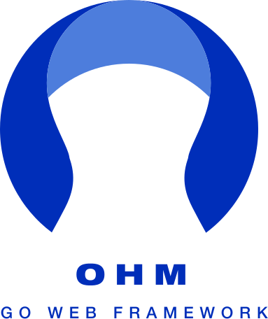

<p align="center">
  
</p>

# Ohm

Ohm is a Go web framework for building server-rendered web apps with clear
defaults and very little magic.

It gives you the shape of a complete web app without hiding Go:

- A framework CLI for creating apps and generating code.
- An app-owned CLI for serving, routing, migrating, seeding, and replaying.
- `chi` routing behind a small Ohm handler layer.
- `templ` views for pages, layouts, components, forms, and errors.
- Typed config backed by deterministic `.env` loading.
- `sqlc` queries and `goose` migrations instead of an ORM.
- Structured `slog` logging with sensitive-value scrubbing.
- Replayable request snapshots that can become regression tests.

Ohm is for people who want the productive parts of a full-stack framework while
keeping ownership of ordinary Go code.

## Install

Install the latest released CLI:

```sh
go install github.com/mgomes/ohm/cmd/ohm@latest
```

From this checkout, install the local CLI:

```sh
go install ./cmd/ohm
```

Check the installed version:

```sh
ohm version
```

## Start an App

SQLite is the fastest local start:

```sh
ohm new journal --db sqlite --module example.com/journal
cd journal
cp .env.development.example .env.development
cp .env.test.example .env.test
just check
just server
```

Postgres is the default production path:

```sh
ohm new journal --db postgres --module example.com/journal
```

Set `DATABASE_URL` in `.env.development` and `.env.test`, then run the same
checks.

## Generate Code

```sh
ohm generate handler Posts
ohm generate migration create_posts
ohm generate resource Posts title:string body:text
```

Generated code is meant to be owned by the app. It should be boring enough to
read, test, and change.

## Operate the App

Each generated app has its own binary. The framework CLI is not required at
runtime.

```sh
go run ./cmd/journal server
go run ./cmd/journal routes
go run ./cmd/journal migrate up
go run ./cmd/journal migrate status
go run ./cmd/journal db seed
go run ./cmd/journal replay ./tmp/replays/request.json
```

## Documentation

- [Getting started](docs/getting-started.md)
- [Application guide](docs/application-guide.md)
- [Release guide](docs/releasing.md)
- [Architecture decisions](docs/adr)

The ADR folder is the current architecture record set. It contains ADRs 0001
through 0009.
